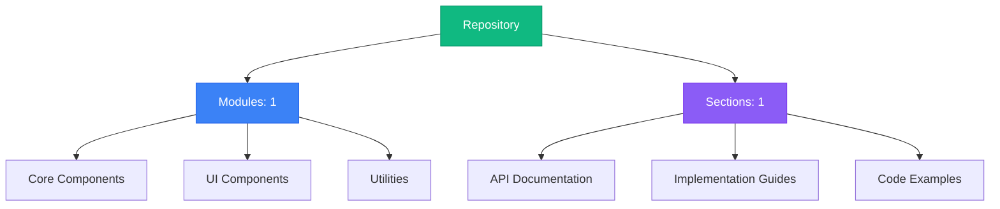
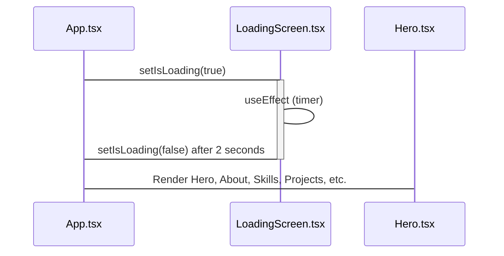
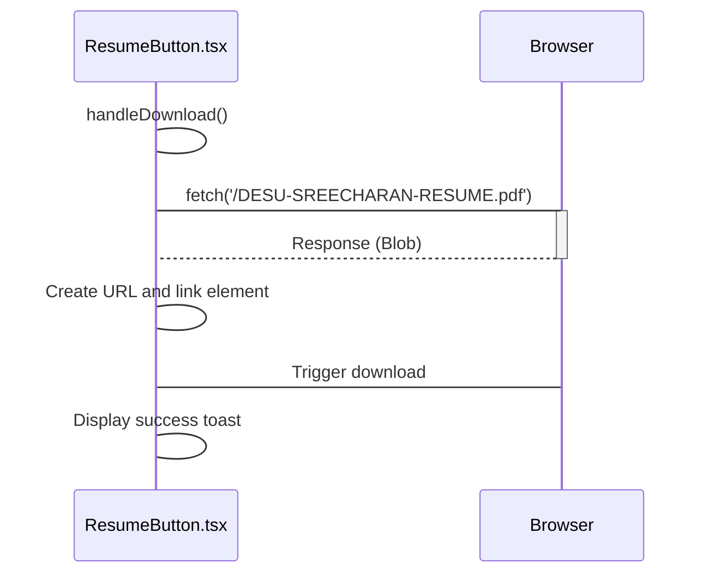
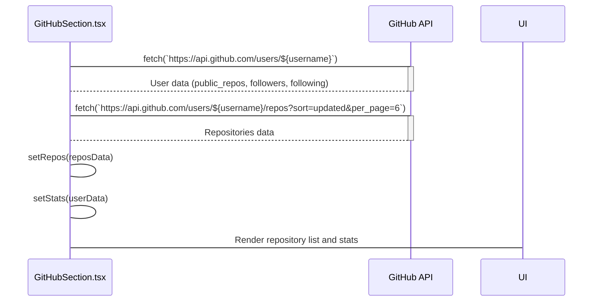

# SreeCharan Desu - AKA 𝚂𝚛3𝚇𝟶𝚛

**Repository Documentation**



## Table of Contents

### 1. Embedding YouTube Videos with the YouTubeSection Component

No description available

**Sections:**


**1.** Embed YouTube Videos Easily: The YouTubeSection React Component

---


## Navigation Guide

- **Modules**: Browse through organized code modules in the left sidebar
- **Sections**: Each module contains multiple documentation sections
- **Search**: Use the search bar to quickly find specific content
- **Headings**: Use the right sidebar to navigate within long documents
- **Actions**: Copy or download any section content using the toolbar buttons


## Technical Documentation: React Component System

This document provides a comprehensive overview of a React component system, detailing its architecture, workflows, usage, and implementation details. The system comprises several components designed to create a dynamic and engaging user interface.

### System Overview

The system is built using React and TypeScript, leveraging libraries like Framer Motion for animations, react-scroll for smooth navigation, and react-tsparticles for background effects. It includes components for displaying a hero section, about information, skills, projects, a timeline, YouTube videos, GitHub repositories, and a footer. The system also incorporates error handling and loading screen functionalities.

### Technical Architecture

The system follows a component-based architecture, where each component is responsible for a specific part of the user interface. The components are designed to be reusable and composable, allowing for flexibility and maintainability.

**Component Relationships:**

The `App.tsx` file serves as the main entry point and orchestrates the rendering of other components. Below is a high-level overview of the component hierarchy:

```
App.tsx
├── ErrorBoundary.tsx
├── LoadingScreen.tsx
├── ResumeButton.tsx
├── Hero.tsx
├── About.tsx
├── Skills.tsx
├── Projects.tsx
├── Footer.tsx
├── Timeline.tsx
├── YouTubeSection.tsx
└── GitHubSection.tsx
```

**Key Dependencies:**

-   **React:** The core library for building user interfaces.
-   **TypeScript:** Adds static typing to JavaScript, improving code quality and maintainability.
-   **Framer Motion:** Used for creating smooth and engaging animations.
-   **react-scroll:** Enables smooth scrolling to different sections of the page.
-   **react-tsparticles:** Provides a particle background effect.
-   **react-hot-toast:** Displays toast notifications for user feedback.

### Main Workflows and Data Flows

#### 1. Initial Loading Workflow

This workflow describes the initial loading sequence of the application.



**Explanation:**

1.  `App.tsx` initializes the `isLoading` state to `true`.
2.  The `LoadingScreen.tsx` component is rendered, displaying a loading animation.
3.  A `useEffect` hook in `LoadingScreen.tsx` sets a timer for 2 seconds.
4.  After 2 seconds, `App.tsx` sets `isLoading` to `false`, causing the main content to render.

#### 2. Resume Download Workflow

This workflow details the process of downloading a resume using the `ResumeButton` component.



**Explanation:**

1.  The user clicks the download button in `ResumeButton.tsx`.
2.  The `handleDownload` function is triggered.
3.  A `fetch` request is made to retrieve the resume file.
4.  The response is converted to a Blob, and a URL is created.
5.  A link element is dynamically created and triggered to initiate the download.
6.  A success toast is displayed to the user.

#### 3. GitHub Data Fetching Workflow

This workflow illustrates how the `GitHubSection` component fetches and displays GitHub repository data.



**Explanation:**

1.  The `GitHubSection.tsx` component mounts and triggers a `useEffect` hook.
2.  The hook fetches user data from the GitHub API.
3.  The hook fetches repository data from the GitHub API.
4.  The fetched data is stored in the `repos` and `stats` state variables.
5.  The component renders the repository list and user statistics.

### Real Code Examples

#### YouTubeSection.tsx

```typescript
import { motion } from 'framer-motion';
import { Element } from 'react-scroll';
import { FaYoutube } from 'react-icons/fa';

const link = "https://www.youtube.com/watch?v=DhWCM4sYR_w";

const YouTubeSection = () => {
    // Extract video ID from the URL
    const videoId = new URL(link).searchParams.get('v') || link.split('v=')[1].split('&')[0];

    // Fallback to default if the ID cannot be found
    if (!videoId) {
        return <div className="text-center text-red-500">Invalid YouTube URL</div>;
    }

    return (
        <Element name="youtube" className="py-20">
            <motion.div
                initial={{ opacity: 0, y: 75 }}
                whileInView={{ opacity: 1, y: 0 }}
                transition={{ duration: 0.75, ease: "easeOut" }}
                viewport={{ once: true }}
                className="flex flex-col items-center"
            >
                <h2 className="text-3xl font-bold mb-6">YouTube Showcase</h2>
                <div className="aspect-w-16 aspect-h-9 w-full max-w-4xl">
                    <iframe
                        src={`https://www.youtube.com/embed/${videoId}`}
                        title="YouTube video player"
                        allow="accelerometer; autoplay; clipboard-write; encrypted-media; gyroscope; picture-in-picture"
                        allowFullScreen
                        className="rounded-lg"
                    />
                </div>
            </motion.div>
        </Element>
    );
};

export default YouTubeSection;
```

**Explanation:**

This component extracts a YouTube video ID from a URL and embeds the video using an iframe. It uses Framer Motion for an entrance animation.

#### Skills.tsx

```typescript
import { motion } from 'framer-motion';
import { Element } from 'react-scroll';
import {
    SiTypescript,
    SiJavascript,
    SiReact,
    SiNextdotjs,
    SiTailwindcss,
    SiNodedotjs,
    SiMongodb,
    SiExpress,
    SiPostgresql,
    SiFirebase,
    SiDocker,
    SiGit,
    SiPython,
    SiBun,
} from 'react-icons/si';
import { FaGit, FaPython, FaNode } from 'react-icons/fa';

const Skills = () => {
    const skills = [
        // **Frontend**
        { name: 'React', icon: <SiReact size={32} color="#61DAFB" /> },
        { name: 'Next.js', icon: <SiNextdotjs size={32} color="#000000" /> },
        { name: 'Tailwind CSS', icon: <SiTailwindcss size={32} color="#38B2AC" /> },
        { name: 'TypeScript', icon: <SiTypescript size={32} color="#3178C6" /> },
        { name: 'JavaScript', icon: <SiJavascript size={32} color="#F7DF1E" /> },

        // **Backend**
        { name: 'Node.js', icon: <FaNode size={32} color="#339933" /> },
        { name: 'Express.js', icon: <SiExpress size={32} color="#000000" /> },
        { name: 'MongoDB', icon: <SiMongodb size={32} color="#47A248" /> },
        { name: 'PostgreSQL', icon: <SiPostgresql size={32} color="#336791" /> },
        { name: 'Firebase', icon: <SiFirebase size={32} color="#FFCA28" /> },
        { name: 'Bun', icon: <SiBun size={32} color="#F7DF1E" /> },

        // **DevOps**
        { name: 'Docker', icon: <SiDocker size={32} color="#2496ED" /> },
        { name: 'Git', icon: <FaGit size={32} color="#F05032" /> },
        { name: 'Python', icon: <FaPython size={32} color="#3776AB" /> },
    ];

    return (
        <Element name="skills" className="py-20">
            <motion.div
                initial={{ opacity: 0, y: 75 }}
                whileInView={{ opacity: 1, y: 0 }}
                transition={{ duration: 0.75, ease: "easeOut" }}
                viewport={{ once: true }}
                className="flex flex-col items-center"
            >
                <h2 className="text-3xl font-bold mb-6">Skills</h2>
                <div className="grid grid-cols-3 md:grid-cols-6 gap-4">
                    {skills.map((skill, index) => (
                        <div key={index} className="flex flex-col items-center">
                            {skill.icon}
                            <p className="text-sm mt-2">{skill.name}</p>
                        </div>
                    ))}
                </div>
            </motion.div>
        </Element>
    );
};

export default Skills;
```

**Explanation:**

This component displays a grid of skills with their corresponding icons. It uses Framer Motion for an entrance animation.

#### ResumeButton.tsx

```typescript
import { useState } from 'react';
import { motion, AnimatePresence } from 'framer-motion';
import { FaFileDownload } from 'react-icons/fa';
import toast, { Toaster } from 'react-hot-toast';

const ResumeButton = () => {
    const [isVisible, setIsVisible] = useState(true);

    const handleDownload = async () => {
        try {
            const response = await fetch('/DESU-SREECHARAN-RESUME.pdf'); // Update with your resume path
            if (!response.ok) throw new Error('Download failed');

            const blob = await response.blob();
            const url = window.URL.createObjectURL(blob);
            const link = document.createElement('a');
            link.href = url;
            link.setAttribute('download', 'DESU-SREECHARAN-RESUME.pdf');
            document.body.appendChild(link);
            link.click();
            link.remove();
            window.URL.revokeObjectURL(url);

            toast.success('Resume downloaded successfully!');
            setIsVisible(false);
        } catch (error) {
            toast.error('Failed to download resume. Please try again.');
            console.error('Download error:', error);
        }
    };

    return (
        <>
            <AnimatePresence>
                {isVisible && (
                    <motion.button
                        initial={{ opacity: 0, y: 50 }}
                        animate={{ opacity: 1, y: 0 }}
                        exit={{ opacity: 0, y: 50 }}
                        transition={{ duration: 0.3 }}
                        className="bg-blue-500 hover:bg-blue-700 text-white font-bold py-2 px-4 rounded focus:outline-none focus:shadow-outline"
                        onClick={handleDownload}
                    >
                        <FaFileDownload className="inline-block mr-2" />
                        Download Resume
                    </motion.button>
                )}
            </AnimatePresence>
            <Toaster />
        </>
    );
};

export default ResumeButton;
```

**Explanation:**

This component provides a button to download a resume file. It uses `fetch` to retrieve the file, creates a download link, and triggers the download. It also uses `react-hot-toast` to display success or error messages.

### How Developers Would Use This in Practice

Developers can use these components to build a personal portfolio website or a similar application. The components can be customized and extended to fit specific needs.

**Example Usage:**

```typescript
import Hero from './components/Hero';
import About from './components/About';
import Skills from './components/Skills';
import Projects from './components/Projects';
import Footer from './components/Footer';

const MyPortfolio = () => {
    return (
        <>
            <Hero />
            <About />
            <Skills />
            <Projects />
            <Footer />
        </>
    );
};

export default MyPortfolio;
```

### Important Implementation Details and Gotchas

-   **Framer Motion:** Ensure that the `motion` components are properly configured with `initial`, `animate`, and `transition` props for smooth animations.
-   **react-scroll:** Use the `Element` component to define scrollable sections and the `Link` component to create smooth navigation links.
-   **GitHub API:** Be mindful of the GitHub API rate limits. Consider implementing caching or using a proxy server to avoid exceeding the limits.
-   **Error Handling:** Implement proper error handling to catch and display errors gracefully.

### Common Issues and Troubleshooting

-   **Animation Issues:** If animations are not working as expected, check the Framer Motion configuration and ensure that the components are properly mounted and unmounted.
-   **Scroll Issues:** If smooth scrolling is not working, verify that the `Element` and `Link` components are correctly configured and that the target elements exist.
-   **GitHub API Errors:** If GitHub data is not loading, check the API status and ensure that the API requests are properly authenticated.

### Advanced Configuration and Customization Options

-   **Customizing Styles:** The components can be styled using CSS or Tailwind CSS.
-   **Adding New Components:** New components can be added to extend the functionality of the system.
-   **Configuring Animations:** The animations can be customized by modifying the Framer Motion props.
-   **Integrating with External Services:** The system can be integrated with external services by making API requests.

### Performance Considerations and Optimization Strategies

-   **Code Splitting:** Use code splitting to reduce the initial load time of the application.
-   **Lazy Loading:** Lazy load components that are not immediately visible to the user.
-   **Caching:** Cache API responses to reduce the number of API requests.
-   **Image Optimization:** Optimize images to reduce their file size.

### Security Implications and Best Practices

-   **Sanitize User Input:** Sanitize user input to prevent cross-site scripting (XSS) attacks.
-   **Use HTTPS:** Use HTTPS to encrypt data transmitted between the client and the server.
-   **Protect API Keys:** Protect API keys and other sensitive information by storing them in environment variables.
-   **Regularly Update Dependencies:** Regularly update dependencies to patch security vulnerabilities.

### Enhanced Flow and Connection Documentation

#### Component Communication Example: App and Hero

The `App` component renders the `Hero` component. Data can be passed from `App` to `Hero` via props.

```typescript
// App.tsx
import Hero from './components/Hero';

const App = () => {
  const heroTitle = "My Awesome Portfolio";
  return (
    <Hero title={heroTitle} />
  );
};

// Hero.tsx
interface HeroProps {
  title: string;
}

const Hero = ({ title }: HeroProps) => {
  return (
    <div>
      <h1>{title}</h1>
    </div>
  );
};
```

#### State Management

The `App` component manages the `isLoading` state, which controls the rendering of the `LoadingScreen`.

#### Error Propagation

The `ErrorBoundary` component catches errors that occur in its child components and displays an error message.

### Conclusion

This documentation provides a comprehensive overview of the React component system, covering its architecture, workflows, usage, and implementation details. Developers can use this documentation to understand and work with the system effectively.
